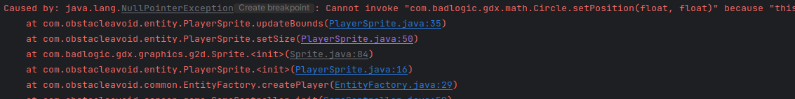

# Sprite
A game object that describes almost everything
* Sprite is a subclass of TextureRegion with additional information.
* Sprite is always rectangular x0,y0 is in bottom left corner
* Position
* Rotation
* Size width/height
* Scale
* Colour
* Texture Info
* Origin from which rotations and scales are performed, so this origin never moves
* Origin is mapped relative to bottom left corner of Sprite

## Sprite mixes Model info (position rotation scale size) with view info (the texture we want to draw)
* So Sprite is inappropriate if implementing design patterns where model and view are strictly separated.


Replace the XKBOPTIONS definition in /etc/default/keyboard with

XKBOPTIONS="ctrl:nocaps"

Option "XkbOptions" "caps:swapescape"

## Null pointer @ 151:


Set size is called from init (constructor) @ 84, meaning SetSize calls updateBounds before they exist:

```java

	// Note the region is copied.
	/** Creates a sprite based on a specific TextureRegion, the new sprite's region is a copy of the parameter region - altering
	 * one does not affect the other */
	public Sprite (TextureRegion region) {
		setRegion(region);
		setColor(1, 1, 1, 1);
		setSize(region.getRegionWidth(), region.getRegionHeight());
		setOrigin(width / 2, height / 2);
	}
```
```java
    @Override
    public void setSize(float width, float height) {
        super.setSize(width, height);
        updateBounds();
    }
```